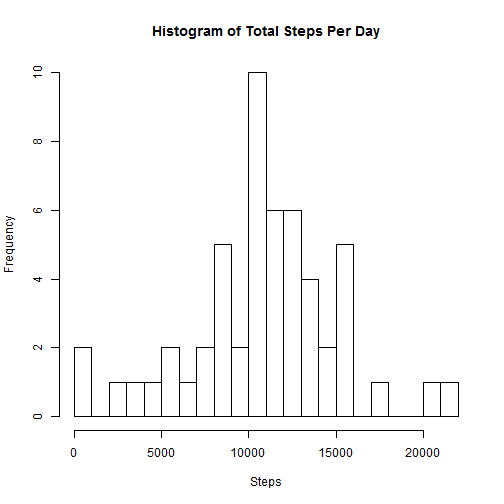

# Reproducible Research: Peer Assessment 1

Please note for this code to work you must have downloaded the plyr, ggplot, grid, and scales packages.  This program will run the library statements for those packages.  
Also note that this program uses the current working directory. 

# Loading and preprocessing the data
### Make sure libraries are installed

```r
library(plyr)
library(ggplot2)
library(scales)
library(grid)
```

### Import and process the data to adjust data types and check the number of rows in the data to compare to documentation provided

```r
setInternet2(use = TRUE)
fileurl = "https://d396qusza40orc.cloudfront.net/repdata%2Fdata%2Factivity.zip"
download.file(fileurl,destfile="activity.zip")
rawactivity <- read.csv(unz("activity.zip","activity.csv"),header=TRUE)

nrow(rawactivity)
```

```
## [1] 17568
```

```r
rawactivity["newdate"] <- as.Date(rawactivity$date)
```
Notice that the interval field is not in minutes but in hours:minutes example goes from 55 to 100 instead of 55 to 60

```r
rawactivity["newinterval"]<-  paste0(substr(sprintf("%04d",rawactivity$interval),1,2),":",
                                     substr(sprintf("%04d",rawactivity$interval),3,4),":00")
rawactivity["intervaldatetime"]<-paste(rawactivity$date,rawactivity$newinterval)
rawactivity["stepsdatetime"]<-as.POSIXct(rawactivity$intervaldatetime)

activity <- rawactivity[c("steps","stepsdatetime")]
str(activity)
```

```
## 'data.frame':	17568 obs. of  2 variables:
##  $ steps        : int  NA NA NA NA NA NA NA NA NA NA ...
##  $ stepsdatetime: POSIXct, format: "2012-10-01 00:00:00" "2012-10-01 00:05:00" ...
```


# What is the mean total number of steps taken per day?

### What is the distribution of total steps taken per day and the mean and median of steps per day

```r
DailyStepTotal  <- aggregate(activity$steps,by=list(as.factor(format(activity$stepsdatetime, "%Y%m%d"))),
                             FUN=sum)
DailyStepTotal = rename(DailyStepTotal,c("Group.1"="Day","x"="TotalSteps"))
DailyStepMean   <- aggregate(activity$steps,by=list(as.factor(format(activity$stepsdatetime, "%Y%m%d"))),
                             FUN=mean)
DailyStepMean = rename(DailyStepMean,c("Group.1"="Day","x"="MeanSteps"))
DailyStepMedian <- aggregate(activity$steps,by=list(as.factor(format(activity$stepsdatetime, "%Y%m%d"))),
                             FUN=median)
DailyStepMedian = rename(DailyStepMedian,c("Group.1"="Day","x"="MedianSteps"))

hist(DailyStepTotal$TotalSteps, breaks = 20, xlab = "Steps", main = "Histogram of Total Steps Per Day")
```

 

```r
DailyTotals  <- merge(DailyStepMean,DailyStepMedian,by="Day")
print(DailyTotals, type = "html")
```

```
##         Day  MeanSteps MedianSteps
## 1  20121001         NA          NA
## 2  20121002  0.4375000           0
## 3  20121003 39.4166667           0
## 4  20121004 42.0694444           0
## 5  20121005 46.1597222           0
## 6  20121006 53.5416667           0
## 7  20121007 38.2465278           0
## 8  20121008         NA          NA
## 9  20121009 44.4826389           0
## 10 20121010 34.3750000           0
## 11 20121011 35.7777778           0
## 12 20121012 60.3541667           0
## 13 20121013 43.1458333           0
## 14 20121014 52.4236111           0
## 15 20121015 35.2048611           0
## 16 20121016 52.3750000           0
## 17 20121017 46.7083333           0
## 18 20121018 34.9166667           0
## 19 20121019 41.0729167           0
## 20 20121020 36.0937500           0
## 21 20121021 30.6284722           0
## 22 20121022 46.7361111           0
## 23 20121023 30.9652778           0
## 24 20121024 29.0104167           0
## 25 20121025  8.6527778           0
## 26 20121026 23.5347222           0
## 27 20121027 35.1354167           0
## 28 20121028 39.7847222           0
## 29 20121029 17.4236111           0
## 30 20121030 34.0937500           0
## 31 20121031 53.5208333           0
## 32 20121101         NA          NA
## 33 20121102 36.8055556           0
## 34 20121103 36.7048611           0
## 35 20121104         NA          NA
## 36 20121105 36.2465278           0
## 37 20121106 28.9375000           0
## 38 20121107 44.7326389           0
## 39 20121108 11.1770833           0
## 40 20121109         NA          NA
## 41 20121110         NA          NA
## 42 20121111 43.7777778           0
## 43 20121112 37.3784722           0
## 44 20121113 25.4722222           0
## 45 20121114         NA          NA
## 46 20121115  0.1423611           0
## 47 20121116 18.8923611           0
## 48 20121117 49.7881944           0
## 49 20121118 52.4652778           0
## 50 20121119 30.6979167           0
## 51 20121120 15.5277778           0
## 52 20121121 44.3993056           0
## 53 20121122 70.9270833           0
## 54 20121123 73.5902778           0
## 55 20121124 50.2708333           0
## 56 20121125 41.0902778           0
## 57 20121126 38.7569444           0
## 58 20121127 47.3819444           0
## 59 20121128 35.3576389           0
## 60 20121129 24.4687500           0
## 61 20121130         NA          NA
```


# What is the average daily activity pattern?
### What is the average steps per interval averaged across all of the days in the data and what time of day had the most average steps
### A time series plot over all 288 intervals reveals some interesting patterns in the data.

```r
IntervalStepMean   <- aggregate(activity$steps,by=list(as.factor(format(activity$stepsdatetime, "%H%M"))),
                                FUN=mean,na.rm = TRUE)
IntervalStepMean = rename(IntervalStepMean,c("Group.1"="Interval","x"="MeanSteps"))
ggplot(data = IntervalStepMean, aes(x=Interval,y = MeanSteps,group=1)) + 
        geom_line()+ theme_bw()+ labs(x="Time of Day") +
        scale_x_discrete(breaks = c("0000","0400","0800","1200","1600","2000","2355")) +
        labs(y = expression("Average Number of Steps"))+ ggtitle("Average Number of Steps During a Day")+
        theme(plot.title = element_text(face="bold"))
```

 

```r
MaxSteps <- max(IntervalStepMean$MeanSteps)
MaxStepsInterval = IntervalStepMean[IntervalStepMean$MeanSteps == MaxSteps,]

MaxStepsTime <- paste0(substr(MaxStepsInterval$Interval,1,2),":",
                       substr(MaxStepsInterval$Interval,3,4))
MaxStepsfrmt <- format(max(IntervalStepMean$MeanSteps),scientific=FALSE,digits=3)
```
### The interval with the most average steps was 08:35 with an average of 206.

# Imputing missing values
The technique used here was to apply the mean for the interval to those intervals with a missing value of NA.

Determine how many rows have NA values for the step column

```r
narowscount = format(nrow(activity[is.na(activity$steps),]),big.mark=",",scientific=FALSE)
totalrecordcount = format(nrow(activity),big.mark=",",scientific=FALSE)
nadayscount = format(nrow(DailyStepTotal[is.na(DailyStepTotal$TotalSteps),]),big.mark=",",scientific=FALSE)
totaldaycount = format(nrow(DailyStepTotal),big.mark=",",scientific=FALSE)
```
### There were 2,304 rows that had NA values out of 17,568 rows.  
### Out of 61 days there were 8 days for which all of the data was missing. 

Impute the NA values by merging the interval mean back to the original dataframe and assigning  
the mean value to any steps for wich the value was NA.  
Essentially NA step values are substituted with the mean for that interval across all days in the dataframe.  

```r
activity["Interval"] <- format(activity$stepsdatetime, "%H%M")
ActivityImputed  <- merge(IntervalStepMean,activity,by="Interval")
ActivityImputed["ImputedSteps"] <- ifelse(is.na(ActivityImputed$steps),ActivityImputed$MeanSteps,ActivityImputed$steps)
```

### What is the distribution of total steps taken per day and the mean and median of steps per day  
### based on the newly imputed steps variable

```r
DailyStepTotalIMP  <- aggregate(ActivityImputed$ImputedSteps,by=list(as.factor(format(ActivityImputed$stepsdatetime, "%Y%m%d"))),
                                FUN=sum)
DailyStepTotalIMP = rename(DailyStepTotalIMP,c("Group.1"="Day","x"="TotalImputedSteps"))
DailyStepMeanIMP   <- aggregate(ActivityImputed$ImputedSteps,by=list(as.factor(format(ActivityImputed$stepsdatetime, "%Y%m%d"))),
                                FUN=mean)
DailyStepMeanIMP = rename(DailyStepMeanIMP,c("Group.1"="Day","x"="MeanImputedSteps"))
DailyStepMedianIMP <- aggregate(ActivityImputed$ImputedSteps,by=list(as.factor(format(ActivityImputed$stepsdatetime, "%Y%m%d"))),
                                FUN=median)
DailyStepMedianIMP = rename(DailyStepMedianIMP,c("Group.1"="Day","x"="MedianImputedSteps"))

hist(DailyStepTotalIMP$TotalImputedSteps, breaks = 20, xlab = "Steps", main = "Histogram of Total Steps Per Day Imputed")
```

 

```r
##Merge the mean and median file created above to create a table with both and write that table out
DailyTotalsIMP  <- merge(DailyStepMeanIMP,DailyStepMedianIMP,by="Day")
print(DailyTotalsIMP, type = "html")
```

```
##         Day MeanImputedSteps MedianImputedSteps
## 1  20121001       37.3825996           34.11321
## 2  20121002        0.4375000            0.00000
## 3  20121003       39.4166667            0.00000
## 4  20121004       42.0694444            0.00000
## 5  20121005       46.1597222            0.00000
## 6  20121006       53.5416667            0.00000
## 7  20121007       38.2465278            0.00000
## 8  20121008       37.3825996           34.11321
## 9  20121009       44.4826389            0.00000
## 10 20121010       34.3750000            0.00000
## 11 20121011       35.7777778            0.00000
## 12 20121012       60.3541667            0.00000
## 13 20121013       43.1458333            0.00000
## 14 20121014       52.4236111            0.00000
## 15 20121015       35.2048611            0.00000
## 16 20121016       52.3750000            0.00000
## 17 20121017       46.7083333            0.00000
## 18 20121018       34.9166667            0.00000
## 19 20121019       41.0729167            0.00000
## 20 20121020       36.0937500            0.00000
## 21 20121021       30.6284722            0.00000
## 22 20121022       46.7361111            0.00000
## 23 20121023       30.9652778            0.00000
## 24 20121024       29.0104167            0.00000
## 25 20121025        8.6527778            0.00000
## 26 20121026       23.5347222            0.00000
## 27 20121027       35.1354167            0.00000
## 28 20121028       39.7847222            0.00000
## 29 20121029       17.4236111            0.00000
## 30 20121030       34.0937500            0.00000
## 31 20121031       53.5208333            0.00000
## 32 20121101       37.3825996           34.11321
## 33 20121102       36.8055556            0.00000
## 34 20121103       36.7048611            0.00000
## 35 20121104       37.3825996           34.11321
## 36 20121105       36.2465278            0.00000
## 37 20121106       28.9375000            0.00000
## 38 20121107       44.7326389            0.00000
## 39 20121108       11.1770833            0.00000
## 40 20121109       37.3825996           34.11321
## 41 20121110       37.3825996           34.11321
## 42 20121111       43.7777778            0.00000
## 43 20121112       37.3784722            0.00000
## 44 20121113       25.4722222            0.00000
## 45 20121114       37.3825996           34.11321
## 46 20121115        0.1423611            0.00000
## 47 20121116       18.8923611            0.00000
## 48 20121117       49.7881944            0.00000
## 49 20121118       52.4652778            0.00000
## 50 20121119       30.6979167            0.00000
## 51 20121120       15.5277778            0.00000
## 52 20121121       44.3993056            0.00000
## 53 20121122       70.9270833            0.00000
## 54 20121123       73.5902778            0.00000
## 55 20121124       50.2708333            0.00000
## 56 20121125       41.0902778            0.00000
## 57 20121126       38.7569444            0.00000
## 58 20121127       47.3819444            0.00000
## 59 20121128       35.3576389            0.00000
## 60 20121129       24.4687500            0.00000
## 61 20121130       37.3825996           34.11321
```

```r
DailyTotalsBoth <- merge(DailyTotals,DailyTotalsIMP,by="Day")
print(DailyTotalsBoth, type = "html")
```

```
##         Day  MeanSteps MedianSteps MeanImputedSteps MedianImputedSteps
## 1  20121001         NA          NA       37.3825996           34.11321
## 2  20121002  0.4375000           0        0.4375000            0.00000
## 3  20121003 39.4166667           0       39.4166667            0.00000
## 4  20121004 42.0694444           0       42.0694444            0.00000
## 5  20121005 46.1597222           0       46.1597222            0.00000
## 6  20121006 53.5416667           0       53.5416667            0.00000
## 7  20121007 38.2465278           0       38.2465278            0.00000
## 8  20121008         NA          NA       37.3825996           34.11321
## 9  20121009 44.4826389           0       44.4826389            0.00000
## 10 20121010 34.3750000           0       34.3750000            0.00000
## 11 20121011 35.7777778           0       35.7777778            0.00000
## 12 20121012 60.3541667           0       60.3541667            0.00000
## 13 20121013 43.1458333           0       43.1458333            0.00000
## 14 20121014 52.4236111           0       52.4236111            0.00000
## 15 20121015 35.2048611           0       35.2048611            0.00000
## 16 20121016 52.3750000           0       52.3750000            0.00000
## 17 20121017 46.7083333           0       46.7083333            0.00000
## 18 20121018 34.9166667           0       34.9166667            0.00000
## 19 20121019 41.0729167           0       41.0729167            0.00000
## 20 20121020 36.0937500           0       36.0937500            0.00000
## 21 20121021 30.6284722           0       30.6284722            0.00000
## 22 20121022 46.7361111           0       46.7361111            0.00000
## 23 20121023 30.9652778           0       30.9652778            0.00000
## 24 20121024 29.0104167           0       29.0104167            0.00000
## 25 20121025  8.6527778           0        8.6527778            0.00000
## 26 20121026 23.5347222           0       23.5347222            0.00000
## 27 20121027 35.1354167           0       35.1354167            0.00000
## 28 20121028 39.7847222           0       39.7847222            0.00000
## 29 20121029 17.4236111           0       17.4236111            0.00000
## 30 20121030 34.0937500           0       34.0937500            0.00000
## 31 20121031 53.5208333           0       53.5208333            0.00000
## 32 20121101         NA          NA       37.3825996           34.11321
## 33 20121102 36.8055556           0       36.8055556            0.00000
## 34 20121103 36.7048611           0       36.7048611            0.00000
## 35 20121104         NA          NA       37.3825996           34.11321
## 36 20121105 36.2465278           0       36.2465278            0.00000
## 37 20121106 28.9375000           0       28.9375000            0.00000
## 38 20121107 44.7326389           0       44.7326389            0.00000
## 39 20121108 11.1770833           0       11.1770833            0.00000
## 40 20121109         NA          NA       37.3825996           34.11321
## 41 20121110         NA          NA       37.3825996           34.11321
## 42 20121111 43.7777778           0       43.7777778            0.00000
## 43 20121112 37.3784722           0       37.3784722            0.00000
## 44 20121113 25.4722222           0       25.4722222            0.00000
## 45 20121114         NA          NA       37.3825996           34.11321
## 46 20121115  0.1423611           0        0.1423611            0.00000
## 47 20121116 18.8923611           0       18.8923611            0.00000
## 48 20121117 49.7881944           0       49.7881944            0.00000
## 49 20121118 52.4652778           0       52.4652778            0.00000
## 50 20121119 30.6979167           0       30.6979167            0.00000
## 51 20121120 15.5277778           0       15.5277778            0.00000
## 52 20121121 44.3993056           0       44.3993056            0.00000
## 53 20121122 70.9270833           0       70.9270833            0.00000
## 54 20121123 73.5902778           0       73.5902778            0.00000
## 55 20121124 50.2708333           0       50.2708333            0.00000
## 56 20121125 41.0902778           0       41.0902778            0.00000
## 57 20121126 38.7569444           0       38.7569444            0.00000
## 58 20121127 47.3819444           0       47.3819444            0.00000
## 59 20121128 35.3576389           0       35.3576389            0.00000
## 60 20121129 24.4687500           0       24.4687500            0.00000
## 61 20121130         NA          NA       37.3825996           34.11321
```
There is no difference in each days mean and median unless that day was NA before.  
The reason for this is that the day was 100% populated or 100% NA.  
For those days that were 100% NA my technique was to substitute the mean for each interval.  
The result was that for days that were previously NA the new total steps are 10,766.  
The mean for those days is 37.383 and median of 34.113.  
Becuase of the 8 new days with 10,766 steps the histogram did larger concenration in that range.  

# Are there differences in activity patterns between weekdays and weekends?
Based on the graph below it appears that the activity is more consistent through the day on weekends.  
However, the most steps on average for a given time of day still occur arount 8:00AM in the morning on weekdays.  

```r
##does activity on weekends differ from activity during the week
##create a weekend variable by checking to see if the day of the week starts with an S (Saturday or Sunday)
ActivityImputed["Weekend"] <- as.factor(ifelse(substr(weekdays(as.POSIXct(ActivityImputed$stepsdatetime),
                                                               abbreviate=TRUE),1,1)=="S","weekend","weekday"))
WEEKEND <- ActivityImputed[ActivityImputed$Weekend == "weekend",]
WEEKDAY <- ActivityImputed[ActivityImputed$Weekend == "weekday",]

WEEKENDSTEPMEAN   <- aggregate(WEEKEND$ImputedSteps,by=list(as.factor(format(WEEKEND$stepsdatetime, "%H%M"))),
                               FUN=mean)
WEEKENDSTEPMEAN = rename(WEEKENDSTEPMEAN,c("Group.1"="Interval","x"="MeanSteps"))
WEEKDAYSTEPMEAN   <- aggregate(WEEKDAY$ImputedSteps,by=list(as.factor(format(WEEKDAY$stepsdatetime, "%H%M"))),
                               FUN=mean)
WEEKDAYSTEPMEAN = rename(WEEKDAYSTEPMEAN,c("Group.1"="Interval","x"="MeanSteps"))

##THIS FUNCTION WAS COPIED FROM THE URL http://www.cookbook-r.com/Graphs/Multiple_graphs_on_one_page_(ggplot2)/
## The cookbook for R 
multiplot <- function(..., plotlist=NULL, cols) {
        require(grid)
        
        # Make a list from the ... arguments and plotlist
        plots <- c(list(...), plotlist)
        
        numPlots = length(plots)
        
        # Make the panel
        plotCols = cols                          # Number of columns of plots
        plotRows = ceiling(numPlots/plotCols) # Number of rows needed, calculated from # of cols
        
        # Set up the page
        grid.newpage()
        pushViewport(viewport(layout = grid.layout(plotRows, plotCols)))
        vplayout <- function(x, y)
                viewport(layout.pos.row = x, layout.pos.col = y)
        
        # Make each plot, in the correct location
        for (i in 1:numPlots) {
                curRow = ceiling(i/plotCols)
                curCol = (i-1) %% plotCols + 1
                print(plots[[i]], vp = vplayout(curRow, curCol ))
        }
        
}

p1 <-
ggplot(data = WEEKENDSTEPMEAN, aes(x=Interval,y = MeanSteps,group=1)) + 
        geom_line()+ theme_bw()+ labs(x="Time of Day") +
        scale_x_discrete(breaks = c("0000","0400","0800","1200","1600","2000","2355")) +
        labs(y = expression("Average Number of Steps"))+ ggtitle("Average Number of Steps During a Weekend")+
        ylim(0,250) +
        theme(plot.title = element_text(face="bold"))
p2 <-
ggplot(data = WEEKDAYSTEPMEAN, aes(x=Interval,y = MeanSteps,group=1)) + 
        geom_line()+ theme_bw()+ labs(x="Time of Day") +
        scale_x_discrete(breaks = c("0000","0400","0800","1200","1600","2000","2355")) +
        labs(y = expression("Average Number of Steps"))+ ggtitle("Average Number of Steps During a Weekday")+
        ylim(0,250) +
        theme(plot.title = element_text(face="bold"))
multiplot(p1, p2, cols=1)
```

 

